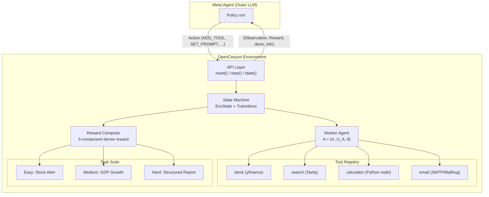

# OpenCesium — Full System Architecture & Implementation Plan

## System Overview

OpenCesium is an **OpenEnv-compliant benchmark environment** where a **meta-agent** (outer LLM) learns to **construct, parameterize, and refine tool-using sub-agents** to complete structured business workflow tasks. The key insight: it benchmarks **agent construction**, not agent execution.



---

## 1. Formal Model (Section 2)

### Entity Definitions

| Entity | Definition |
|--------|-----------|
| **Tool** `u ∈ U` | Deterministic callable `u: X_u → Y_u` with typed I/O |
| **Worker Agent** `A` | Triple `(π_a, U_A, θ)` — LLM policy, tool subset, config vector |
| **Task** `T` | Tuple `(G, U_T, Φ_T, κ)` — goal, required tools, grader, step budget |
| **Meta-Action** `a_m ∈ A_m` | `{AddTool, RemoveTool, SetPrompt, SetStrategy, Evaluate, Noop}` |

### Sequential Decision Process (MDP)

```
M = (S, A_m, T, R, γ, H)

State:     s_t = (T, A_t, h_t, r_{t-1})
Transition: s_{t+1} = T(s_t, a_t)
Reward:    R_t = Φ_T(A_{t+1}, T) − Φ_T(A_t, T) − λ·C(a_t)
                  \_________performance_gain________/  \_action_cost_/
Objective: max_{π_m} E[Σ γ^t R_t]
```

### Termination Conditions
Episode ends at `τ = min{t | t ≥ H  or  (Evaluate ∈ a_t  and  Φ_T(A_t, T) ≥ θ_pass)}`

### Action Validation Layer
- Unknown action type → converted to NOOP with penalty
- Invalid payload schema → logged in error_log
- Tool not in registry → ignored with penalty

---

## 2. OpenEnv API Contract (Section 3)

### Core Pydantic Models

#### Observation (11 fields)
| Field | Type | Default |
|-------|------|---------|
| `task_id` | `str` | required |
| `task_description` | `str` | required |
| `available_tools` | `List[str]` | required |
| `agent_config` | `Dict[str, Any]` | required |
| `last_score` | `float` | `0.0` |
| `last_reward` | `float` | `0.0` |
| `step_index` | `int` | `0` |
| `max_steps` | `int` | required |
| `history` | `List[Dict[str, Any]]` | `[]` |
| `tool_execution_log` | `List[str]` | `[]` |
| `error_log` | `List[str]` | `[]` |
| `done` | `bool` | `False` |

#### Action
| Field | Type |
|-------|------|
| `action_type` | `Literal["ADD_TOOL", "REMOVE_TOOL", "SET_PROMPT", "SET_STRATEGY", "EVALUATE", "NOOP"]` |
| `payload` | `Dict[str, Any]` (keys: tool, prompt, strategy, params) |

#### Reward
| Field | Type |
|-------|------|
| `total` | `float` |
| `components` | `Dict[str, float]` |

### API Endpoints

| Method | Endpoint | Python | Returns |
|--------|----------|--------|---------|
| `POST` | `/reset` | `env.reset()` | `Observation` |
| `POST` | `/step` | `env.step(action)` | `(Observation, Reward, bool, dict)` |
| `POST` | `/state` | `env.state()` | `dict` (serialized EnvState) |
| `GET` | `/health` | — | HTTP 200 |

### State Isolation Rules
- No cross-episode memory
- Agent config reset on `reset()`
- All logs cleared between episodes

---

## 3. Task Suite (Section 4)

### Task 1 — Financial Alert Report (Easy)

| Property | Value |
|----------|-------|
| ID | `task_easy_stock_alert` |
| Goal | Retrieve AAPL price, format alert, email to recipient |
| Required tools | `stock`, `email` |
| Max steps | 10 |
| Pass threshold | Φ ≥ 0.7 |

**Grader components:**

| fi | Criterion | Weight | Measurement |
|----|-----------|--------|-------------|
| f1 | Stock price retrieved and numeric | 0.40 | `isinstance(price, float)` |
| f2 | Email sent (receipt confirmed) | 0.40 | SMTP receipt bool |
| f3 | Ticker symbol present in email body | 0.20 | substring match |

---

### Task 2 — GDP Growth Analysis (Medium)

| Property | Value |
|----------|-------|
| ID | `task_medium_gdp_growth` |
| Goal | Search GDP for 2 countries, compute YoY growth, email summary |
| Required tools | `search`, `calculator`, `email` |
| Max steps | 15 |
| Formula | `g = (GDP_t − GDP_{t-1}) / GDP_{t-1} × 100%` |

**Grader components:**

| fi | Criterion | Weight | Measurement |
|----|-----------|--------|-------------|
| f1 | GDP data retrieved for both countries | 0.25 | 2 numeric values present |
| f2 | Growth rate computed correctly (±0.5%) | 0.30 | abs error < 0.5 |
| f3 | Email sent | 0.25 | receipt bool |
| f4 | Report contains % + comparison | 0.20 | keyword match |

---

### Task 3 — Multi-Source Structured Report (Hard)

| Property | Value |
|----------|-------|
| ID | `task_hard_structured_report` |
| Goal | Fetch stock data + history, search news, compute SMA7, build 4-section Markdown report, email it |
| Required tools | `stock`, `search`, `calculator`, `email` |
| Max steps | 20 |
| Formula | `SMA7 = (1/7) × Σ p_{t-i}` for i=0..6 |

**Grader components:**

| fi | Criterion | Weight | Measurement |
|----|-----------|--------|-------------|
| f1 | Stock price + 7-day history retrieved | 0.15 | 8 numeric entries |
| f2 | News snippets fetched | 0.15 | ≥ 1 result |
| f3 | SMA7 correct (±0.01) | 0.20 | abs error threshold |
| f4 | Report ≥ 4 required sections | 0.20 | heading presence |
| f5 | Email sent with full report body | 0.20 | receipt + body length |
| f6 | No redundant consecutive tool calls | 0.10 | log analysis |

Required sections: **Header, Data Section, Computation Section, Executive Summary**

---

## 4. Reward Function (Section 5)

### 5-Component Dense Reward

At each step t:

```
R_t = α·ΔC_t + β·U_t + γ·E_t − δ·I_t − ε·L_t
```

| Symbol | Name | Semantics | Range | Weight |
|--------|------|-----------|-------|--------|
| `ΔC_t` | Performance gain | Incremental grader score improvement | [-1, 1] | α = 0.40 |
| `U_t` | Tool correctness | Required tool used correctly this step | {0, 1} | β = 0.20 |
| `E_t` | Step efficiency | Bonus for acting early: `1 − t/κ` | [0, 1] | γ = 0.15 |
| `I_t` | Invalid action | Malformed or disallowed action | {0, 1} | δ = 0.20 |
| `L_t` | Loop penalty | Same action repeated consecutively | {0, 1} | ε = 0.10 |

### Reward Pipeline
1. Apply meta-action `a_t`
2. Update agent configuration `A_t`
3. If `Evaluate`, compute `Φ_T(A_t, T)`
4. Compute `ΔC_t` (performance gain)
5. Compute auxiliary signals: `U_t`, `E_t`, `I_t`, `L_t`
6. Aggregate into `R_t`

### Illustrative Values

| Agent Behaviour | R_t |
|----------------|-----|
| Adds a correctly required tool | +0.20 |
| Evaluate after full correct config | +0.40 |
| Adds irrelevant tool not in U_T | −0.05 |
| Evaluate on empty config | −0.15 |
| Completes at step 6/10 (40% remaining) | +0.06 bonus |
| Repeats AddTool(stock) consecutively | −0.10 |
| Malformed JSON action | −0.20 |

### Cumulative Bounds
`G = Σ R_t ∈ [−3.0, 2.0]` (approximate)

---

## 5. Tool Abstraction Layer (Section 6)

### Base Interface

```python
class ToolResult(BaseModel):
    success: bool
    output: Any
    error: str = ""
    latency_ms: float = 0.0

class BaseTool(ABC):
    name: str
    description: str
    input_schema: dict
    output_schema: dict
    cost: float = 0.0  # Used in reward cost model

    @abstractmethod
    def run(self, params: dict) -> ToolResult: ...
```

### Tool Registry

| ID | Backend | Function | Returns | Cost |
|----|---------|----------|---------|------|
| `stock` | yfinance | Live price + OHLCV history; SMA computation | JSON record | 0.05 |
| `search` | Tavily/SerpAPI | Ranked web snippets with source attribution | List[dict] | 0.10 |
| `calculator` | Python (math) | Arithmetic, percentage, moving average | float | 0.02 |
| `email` | SMTP/Mailhog | Send formatted message to specified address | receipt dict | 0.10 |

### Development vs Production Mode
- **Development** (`ENV_MODE=development`): Email backed by Mailhog (in-process SMTP capture)
- **Production** (`ENV_MODE=production`): Real SMTP via env vars (`SMTP_HOST`, `SMTP_PORT`, `SMTP_USER`, `SMTP_PASS`)

---

## 6. Repository Structure (Section 7)

```
opencesium/
├── env/
│   ├── __init__.py
│   ├── core.py           # OpenCesiumEnv class (reset/step/state)
│   ├── models.py         # Pydantic: Observation, Action, Reward, EnvState
│   ├── transitions.py    # Action execution and state transition logic
│   └── episode.py        # Episode tracking, history, termination
├── tasks/
│   ├── __init__.py
│   ├── registry.py       # TASK_REGISTRY dict
│   ├── easy.py           # Task 1 definition + grader
│   ├── medium.py         # Task 2 definition + grader
│   └── hard.py           # Task 3 definition + grader
├── tools/
│   ├── __init__.py
│   ├── base.py           # BaseTool, ToolResult
│   ├── stock.py          # StockTool (yfinance)
│   ├── search.py         # SearchTool (Tavily)
│   ├── calculator.py     # CalculatorTool
│   └── email_tool.py     # EmailTool (SMTP/Mailhog)
├── server/
│   ├── app.py            # FastAPI server
│   └── routes.py         # /reset, /step, /state, /health
├── inference.py          # Baseline agent loop (OpenAI client)
├── openenv.yaml          # Spec metadata
├── Dockerfile
├── requirements.txt
└── README.md
```

---

## 7. Deployment Architecture (Section 9)

- **Base image:** `python:3.11-slim`
- **Port:** 7860
- **Server:** `uvicorn server.app:app`
- **Health check:** `curl -f http://localhost:7860/health`
- **Env vars:** `PYTHONUNBUFFERED=1`, `ENV_MODE=development`

---

## 8. Strategy Space (Section 7.4)

The meta-agent can configure the worker's execution strategy via `SET_STRATEGY`:

| Strategy | Behaviour |
|----------|-----------|
| `react` | Iterative reasoning + tool calls |
| `plan_execute` | Planning followed by execution |
| `direct` | Minimal reasoning |

---

## Proposed Implementation Order

Following the spec's 10-phase development schedule:

| Phase | Module | Deliverables | Priority |
|-------|--------|-------------|----------|
| P1 | `env/models.py` | All Pydantic models | Critical |
| P2 | `env/core.py` | reset()/step()/state() skeleton | Critical |
| P3 | `tools/` | All 4 tool implementations | Critical |
| P4 | `tasks/` | 3 graders + task definitions | Critical |
| P5 | `env/transitions.py` | Full action dispatch + reward computation | Critical |
| P6 | `server/app.py` | FastAPI HTTP layer + health check | High |
| P7 | `inference.py` | Agent loop + baseline scores | High |
| P8 | `Dockerfile` | Container build + verification | High |
| P9 | `openenv.yaml` | Spec metadata | High |
| P10 | `requirements.txt`, `README.md` | Dependencies + documentation | Medium |

---

## User Review Required

> [!IMPORTANT]
> **Email Backend**: The spec calls for Mailhog in development mode and real SMTP in production. For the initial implementation, I'll use Mailhog simulation (mock SMTP capture) so the environment works standalone without external SMTP. Confirm this is acceptable.

> [!IMPORTANT]
> **Search Tool Backend**: The spec lists Tavily/SerpAPI. Both require API keys. I'll implement Tavily as primary with SerpAPI fallback. Do you have API keys, or should I implement a mock search for development?

> [!IMPORTANT]
> **Stock Tool (yfinance)**: yfinance works without API keys but requires internet. This should work as-is. Confirm.

## Open Questions

1. **API Keys**: Do you have `TAVILY_API_KEY` (for search tool) available? If not, I'll implement a deterministic mock for development mode.
2. **Mailhog**: Should I include Mailhog as a Docker dependency, or is a pure-Python mock SMTP sufficient?
3. **Worker Agent Execution**: The spec says the meta-agent configures a worker agent which then executes. When `EVALUATE` is called, should the worker actually invoke the LLM + tools, or should the grader evaluate the *configuration quality* deterministically? (The spec's grader code suggests deterministic evaluation of output dicts — I'll implement it that way.)

## Verification Plan

### Automated Tests
- `pytest` unit tests for each grader with known-correct and known-incorrect inputs
- Integration test: scripted action sequences through full episodes
- `openenv validate` compliance check
- `docker build && docker run` smoke test
- Health check: `GET /health` returns 200

### Manual Verification
- Run `inference.py` 3 times, verify score std < 0.01
- Total runtime < 20 min on 2 vCPU / 8 GB
